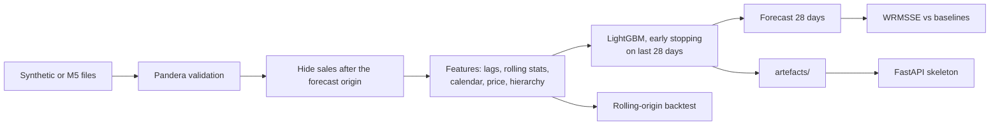

# Retail demand forecasting

[](https://github.com/dsugurtuna/retail-demand-forecasting-at-scale/actions/workflows/ci.yml)
[](https://github.com/dsugurtuna/retail-demand-forecasting-at-scale/actions/workflows/train.yml)

A LightGBM pipeline that forecasts daily unit sales 28 days ahead for M5-style retail data, with leakage-safe features, rolling-origin backtests and the M5 competition's WRMSSE metric, checked against naive baselines on every run.

## The problem

Stores need a daily forecast for every item, weeks ahead, to decide what to stock. Most item-store series are short, noisy and full of zero days, so the hard parts are not the model: they are building features that do not quietly use the future, scoring forecasts in a way that reflects money and stock decisions, and showing the result beats what a planner could do with a spreadsheet.

## What this does

- **Loads** the [M5 competition](https://www.kaggle.com/c/m5-forecasting-accuracy) files (sales, calendar, prices), or generates synthetic data in the same format, and **validates** them with Pandera before anything else runs.
- **Builds features** (115 model inputs in the smoke run; the exact count for each run is in its `metrics.json`): lags and rolling statistics of sales, calendar and UK/US holiday signals, price changes and promotion flags, and lagged totals and shares for item, department, category, store and state. Every sales-based feature is at least 28 days old.
- **Trains** one LightGBM model across all series (Tweedie objective by default; an optional weighted squared-error objective acts as a WRMSSE surrogate), with early stopping on the last 28 days before the forecast origin.
- **Scores** the next 28 days with WRMSSE at the 12 M5 aggregation levels, plus RMSE and MAE, against two baselines: "repeat last week" and "last 28-day average".
- **Backtests** over several forecast origins, rebuilding features and retraining in each fold.
- **Writes** the model, metrics, forecasts and settings to disk, and includes a FastAPI skeleton that can load the model (see Limitations).

## Quickstart

Python 3.11 or 3.12. Runs offline; no API keys, no downloads.

```bash
git clone https://github.com/dsugurtuna/retail-demand-forecasting-at-scale.git
cd retail-demand-forecasting-at-scale
python -m venv .venv && source .venv/bin/activate
pip install -e ".[dev]"

python -m src.train --smoke      # synthetic data, under a minute; exit code 1 if a check fails
pytest                           # full suite, includes the same smoke run
```

The smoke run prints a results table (see "Results from the smoke run" below) and writes `artefacts/smoke/` (model, `metrics.json`, `predictions.csv`, `feature_importance.csv`, `run_config.json`).

Serve the model it just trained:

```bash
FORECAST_MODEL_PATH=artefacts/smoke/model uvicorn src.serving.api:app --port 8000
curl -s -X POST localhost:8000/predict -H 'content-type: application/json' \
  -d '{"item_id": "FOODS_1_001", "store_id": "CA_1", "forecast_date": "2013-01-05", "price": 2.5}'
```

On the real M5 data (download `sales_train_evaluation.csv`, `calendar.csv` and `sell_prices.csv` from the Kaggle competition into `data/raw/` yourself; the data is not redistributed here):

```bash
python -m src.train --data-dir data/raw --stores CA_1
```

That path is tested on synthetic files written in the M5 layout, but no result on the real M5 data has been produced by this code yet, so none is reported.

## Results from the smoke run

Synthetic data only: 21 items x 5 stores x 730 days, generated by `src/data/synthetic.py` with seed 42. These numbers show the pipeline works end to end and that the model finds the signal the generator put in. **They say nothing about accuracy on real retail data.**

Command: `python -m src.train --smoke`. Produced on Linux x86_64, Python 3.12, LightGBM 4.7.0; other platforms or library versions may differ in the last digits.

Holdout: forecast origin 2012-12-30, forecasting the 28 days to 2013-01-27, 105 series, 115 features.

| Forecast | WRMSSE, 12 levels | WRMSSE, item-store level | RMSE | MAE |
|---|---:|---:|---:|---:|
| LightGBM (this pipeline) | 0.7172 | 0.7645 | 3.1034 | 1.9624 |
| Repeat last week | 0.9372 | 1.0538 | 4.2612 | 2.6452 |
| Mean of last 28 days | 0.9078 | 0.8009 | 3.2607 | 2.0787 |

Rolling-origin backtest, two origins 28 days apart: WRMSSE 0.6298 and 0.7172 (mean 0.6735). The second fold has the same origin as the holdout and reproduces its score, which is a check that the backtest and the holdout see the same data.

Read with care: at the item-store level the model's lead over the 28-day mean is small (0.76 against 0.80). Most of its advantage is at the aggregate levels (total: 0.62 against 1.08), where noise averages out and the weekly pattern that a flat average ignores dominates. Per-level scores are in `metrics.json` under `wrmsse_by_level`.

WRMSSE is scale-free and 0 is perfect. The 12-level score averages the item-store level with 11 aggregate levels (store, department, state, total and so on), as in M5.

## How it works



More detail, including a module map and the four leakage controls, is in [docs/ARCHITECTURE.md](docs/ARCHITECTURE.md).

## Design decisions

Short version; each is argued in [docs/WHY.md](docs/WHY.md).

- **One global model, not one per series**, because short, sparse series have little to learn from on their own.
- **Every sales-based feature is at least 28 days old**, so one model forecasts the whole horizon directly, with no recursive feedback of its own errors.
- **Future sales are hidden before features are built**, so a badly written feature reads nulls, not answers. A test scrambles hidden values and checks no feature changes.
- **Tweedie objective**, because sales are non-negative counts with many zeros.
- **WRMSSE at 12 levels**, because it compares slow and fast movers fairly, weights by money, and rewards forecasts that add up where stock decisions are made.
- **Baselines in every run**, because a score means nothing without "what would the simple rule have done?".
- **Missing stays missing**; nothing is filled with 0, because 0 sales is a claim.
- **Metrics go to JSON**, so a run needs no services; any tracker can ingest them later.

## Limitations and what this is not

- **No real-data result yet.** All published numbers are from synthetic data.
- **The API is a skeleton.** It computes calendar features for the requested date but does not look up recent sales, so every lag, rolling and hierarchical feature reaches the model as missing. Its forecasts are not the ones the training run scores. There is no authentication, rate limiting or TLS.
- **Prediction intervals are a placeholder**: a fixed ±20% band, not calibrated, coverage never measured.
- **Only LightGBM is implemented.** The ensemble class combines LightGBM models; there are no deep-learning models. Earlier versions of this README described Temporal Fusion Transformer and N-BEATS models that were never in the code.
- **Memory.** Features are held in memory as float32. A synthetic run of 2,100 series x 1,941 days (`python -m src.train --synthetic --n-items 210 --n-stores 10 --n-days 1941 --n-estimators 300 --backtest-folds 1`) peaked at 10.2 GB of RAM and took about 9 minutes on 4 shared CPUs. One M5 store has about 45% more rows than that and has not been measured; all 30,490 M5 series (about 14.5 times the rows) will not fit on a standard CI runner. Use `--stores` to train on a subset.
- **Prices are treated as known through the horizon**, as in M5. In a real business that depends on promotion plans not changing.
- **Not included:** Airflow or any scheduler beyond GitHub Actions, MLflow or any experiment tracker, Kubernetes manifests, a feature-serving store, monitoring beyond simple request counters. `src/features/store.py` is a local Parquet cache of feature sets, not an online feature store. The Docker files are not built in CI. Earlier versions of this README listed several of these, along with business-impact and benchmark figures that no code in the repository produced; they have been removed (see [CHANGELOG.md](CHANGELOG.md)).
- The YAML files in `config/` are read by `src/utils/config.py` but not yet by the training command, which takes flags.

## Roadmap

1. Run on the real M5 data for one store; publish the command, scores and baselines, including where the model loses.
2. Compare horizon-bucketed models (for example days 1-7, 8-14, 15-28) with the single 28-day model in backtests.
3. Compare the WRMSSE surrogate objective with Tweedie on the same folds.
4. Quantile or conformal intervals with measured coverage.
5. A history lookup in the API so it serves the forecasts that training scores.
6. Build the Docker images in CI; read `config/*.yaml` from the training command.

## Project layout

```
src/
  data/         synthetic generator, M5 loader, Pandera validation
  features/     temporal, price and hierarchical features; local feature cache
  models/       LightGBM wrapper, ensemble
  evaluation/   metrics (incl. WRMSSE), rolling-origin backtests
  serving/      FastAPI skeleton
  train.py      the training command
tests/          unit and integration tests (offline, synthetic data)
docs/           ARCHITECTURE.md, API_REFERENCE.md, WHY.md
notebooks/      a step-by-step walkthrough on synthetic data
.github/        CI (lint, types, tests on 3.11 and 3.12) and the training workflow
```

The weekly **Model Training** workflow runs the smoke run; larger synthetic runs and M5 runs are started by hand, with inputs documented at the top of `.github/workflows/train.yml`.

## Licence

MIT. See [LICENSE](LICENSE). The M5 data is not included and is subject to the Kaggle competition's terms.

---

Personal project by [Ugur Tuna](https://github.com/dsugurtuna). Not affiliated with or endorsed by any employer.
