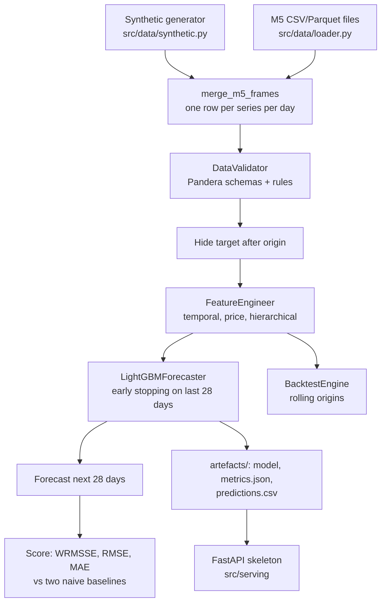

# Architecture

What each part of the code does, how data flows through it and where the leakage controls sit. For the reasons behind the choices, see [WHY.md](WHY.md).

## Data flow

## Modules

| Module | What it does |
|---|---|
| `src/data/synthetic.py` | Generates M5-shaped sales, calendar and prices. Demand responds to weekday, season, trend, events, SNAP days and price (promotions lift sales). Poisson counts, so slow movers have zero days. Can write M5-format CSVs. |
| `src/data/loader.py` | Reads the three M5 files (CSV or Parquet) from a local directory, optionally for some stores, melts sales to long format and joins everything. Raises if a file is missing. |
| `src/data/validators.py` | Pandera schemas for sales, calendar and prices, plus rules for duplicates, negative sales and history length. |
| `src/data/preprocessor.py` | Optional outlier capping and dtype shrinking. Not used by the training run. |
| `src/features/temporal.py` | Lags (only those >= `min_lag`), rolling mean/std/min/max/CV on the target shifted by `min_lag`, expanding mean, calendar and cyclical encodings, UK and US holiday flags and distances. `add_calendar_features` is shared with serving. |
| `src/features/price.py` | Price change, momentum, volatility, promotion flags, price relative to category and store. Prices are treated as known for the horizon, as in M5. |
| `src/features/hierarchical.py` | For item, department, category, store and state: rolling statistics of the level's daily total shifted by `min_lag`, and each series' lagged share of that total. |
| `src/features/engineer.py` | Runs the generators, pushes one `min_lag` into all of them, turns inf/NaN into missing, drops constant columns, stores features as float32 and decides which columns are model inputs. |
| `src/features/store.py` | Local cache of feature sets: versioned Parquet plus JSON metadata. Not an online feature store. |
| `src/models/lightgbm_model.py` | LightGBM wrapper: Tweedie by default, optional weighted squared-error objective (a WRMSSE surrogate), early stopping, save/load, deterministic training. |
| `src/models/ensemble.py` | Weighted average of fitted models, with weights optimised on validation data. Only LightGBM members exist today. |
| `src/evaluation/metrics.py` | RMSE, MAE, MAPE, sMAPE, MASE, and WRMSSE: per-series, the M5 scale, 12-level hierarchical, and row weights for the surrogate objective. |
| `src/evaluation/backtesting.py` | Rolling-origin backtests with per-fold feature building and a fresh model per fold. |
| `src/train.py` | The command-line pipeline and the smoke checks. |
| `src/serving/` | FastAPI app and prediction service. See the limitation in [API_REFERENCE.md](API_REFERENCE.md). |
| `src/utils/` | Typed settings (`config.py`) and logging setup. The training CLI takes flags and does not read the YAML files yet. |

## Leakage controls

A forecast made at origin *T* for day *T + h* may only use target values from day *T* or earlier. The code enforces this in four places:

1. **Feature construction.** Every target-based feature is shifted by `min_lag` days before any rolling or cumulative operation. With `min_lag` equal to the horizon (28), a feature for day *T + 28* uses nothing after day *T*.
2. **Masking.** Before features are built for a forecast or a backtest fold, target values after the origin are replaced with nulls. Even a misconfigured feature cannot read them.
3. **Validation.** Early stopping uses the last 28 days before the origin, chosen by date.
4. **Tests.** `tests/unit/test_features.py::TestNoLeakage` scrambles target values after a cut-off and checks that no feature up to *cut-off + min_lag* changes. The smoke run repeats the same check on its own data every time it runs.

Prices, calendar, events and SNAP flags are treated as known in advance, as in the M5 data.

## Outputs of a training run

`python -m src.train ... --output-dir DIR` writes:

| File | Contents |
|---|---|
| `DIR/model/` | `model.txt` (LightGBM), `metadata.json`, `config.json`, `categorical_features.json` |
| `DIR/metrics.json` | Data summary, feature counts, holdout scores for the model and baselines, WRMSSE by level, backtest folds, smoke checks, versions |
| `DIR/predictions.csv` | Actuals, model forecasts and both baselines for the holdout window |
| `DIR/feature_importance.csv` | LightGBM gain importance |
| `DIR/run_config.json` | Every setting used |

## CI

- `.github/workflows/ci.yml`: ruff, ruff format, mypy, and pytest on Python 3.11 and 3.12. The test suite includes the smoke training run.
- `.github/workflows/train.yml`: the smoke run weekly; larger synthetic or M5 runs on manual dispatch (inputs are documented in the file).

Docker files exist but are not built in CI.
